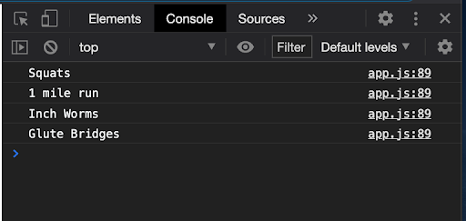

# Functions, Scope, Arrays, Loops, & Iterators Debrief Activity

## Random Exercise Generator
​
### **Challenge 1**
You will be creating a Random Exercise Generator. Build an array with the items listed below in it. Then create a function (using regular function declaration syntax) that will select a specified number of exercises (number will be passed into the function) and prints the random exercises to the console. It is ok if an exercise appears more than once in the output.
​
`Array  items:`
​
`Push-ups, Sit-ups, Bear Crawls, 1 mile run, 60 second plank, Burpees, Jumping Jacks, Squats, Weighted Squats, Inch Worms`
​
​
Example:
```JavaScript
randomExercise(4)
```

The code above will produce the output shown below.
​


### **Challenge 2**

 Create a function with the same functionality as #1, but this time using function expression syntax.

###  **Challenge 3**

 Create a function with the same functionality as #1, but this time using an arrow function.
​
​
### **Challenge 4**
​
**ARNOLD SAYS**
​
You need some workout help so you hired Arnold Schwarzennager  as your fitness coach. He's very opinionated and only likes his exercises and doesn't like others.
​
Arnold's best exercises workout list:
 *Squats, Weighted Squats, 60 second plank, 1 mile run*
​
Using a **nested loop**, check to see if your selected exercise is also on Arnold's list.  After the console.log() of each selected exercise,  your code should log "ARNOLD SAYS: This is a good exercise. I am going to PUMP YOU UP!"  if the exercise is also in the Arnold's list.
​
### 🏆 **Bonus Challenges**
​
1. **Percentage**
In your code-  calculate the percentage of your randomly generated exercises that are part of Arnolds list.  If **50% or more** of the randomly generated exercises are Arnold's recommended exercises, print to the console "ARNOLD SAYS: Good job, {percentage} of your exercises are Arnold approved. If you keep going you will get strong like me!".  If you do **less than 50%** then print "Only {percentage} of your workout is Arnold approved. You are foolish and weak!".
​
2. **Moody Arnold**
Arnold has an upset stomach and is moody. Now everytime you do an exercise that isn't on Arnold's list he is upset.  Before we printed "ARNOLD SAYS: This is a good exercise. I am going to PUMP YOU UP!" everytime you did an Arnold exercise. Now can you write the code so that if the exercise is not in Arnolds list- print to the console "ARNOLD SAYS: This exercise is wimpy and you might as well be eating twinkies on the couch!"

### Helpful Links

- Functions
  - [Function Declarations](https://www.codecademy.com/courses/introduction-to-javascript/lessons/functions/exercises/function-declaration)
  - [Function Expressions](https://www.codecademy.com/courses/introduction-to-javascript/lessons/functions/exercises/function-expressions)
  - [Arrow Functions](https://www.codecademy.com/courses/introduction-to-javascript/lessons/functions/exercises/arrow-functions)
  - [JavaScript Function Definitions - w3](https://www.w3schools.com/js/js_function_definition.asp)
  - [JavaScript Function Invocation - w3](https://www.w3schools.com/js/js_function_invocation.asp#:~:text=Invoking%20a%20JavaScript%20Function,of%20%22invoke%20a%20function%22.)
  - [Params and Args - w3](https://www.w3schools.com/js/js_function_parameters.asp)
  - [JS Functions - Tutorials Teacher](https://www.tutorialsteacher.com/javascript/javascript-function)
  - [Functions - MDN](https://developer.mozilla.org/en-US/docs/Web/JavaScript/Guide/Functions#Function_Scope)
  - [ES6 Arrow Functions - FreeCodeCamp](https://www.freecodecamp.org/news/when-and-why-you-should-use-es6-arrow-functions-and-when-you-shouldnt-3d851d7f0b26/)
